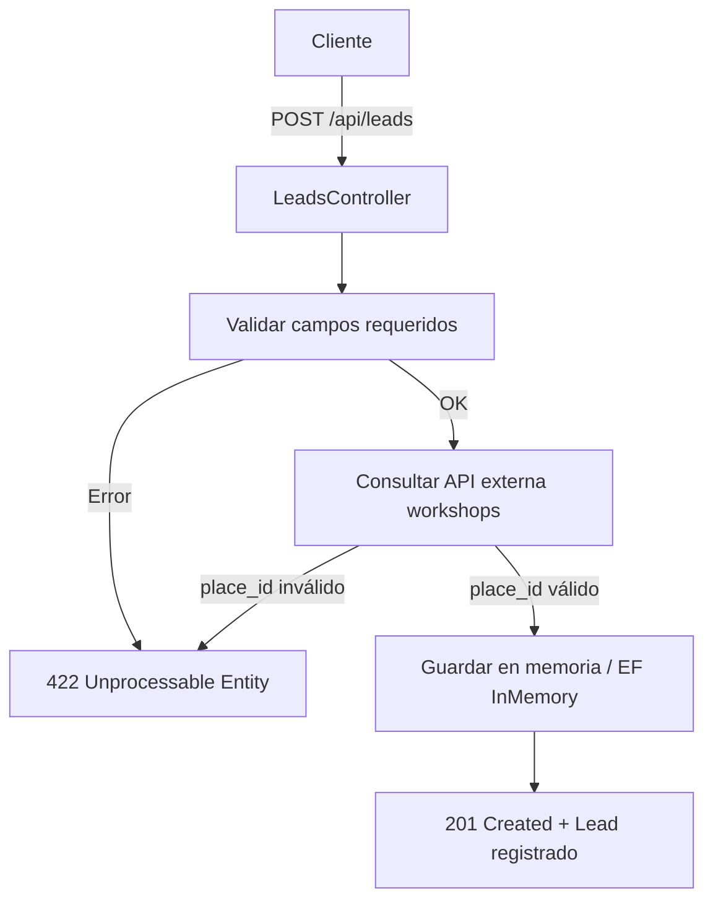

# BoxesChallenge

## Diagrama

```mermaid
flowchart TD
    A[Cliente] -->|POST /api/leads| B[LeadsController]
    B --> C[Validar campos requeridos]
    C -->|OK| D[Consultar API externa workshops]
    C -->|Error| F[400 Bad Request]

    D -->|place_id válido| E[Guardar en memoria / EF InMemory]
    D -->|place_id inválido| F[422 Unprocessable Entity]

    E --> G[201 Created + Lead registrado]
```