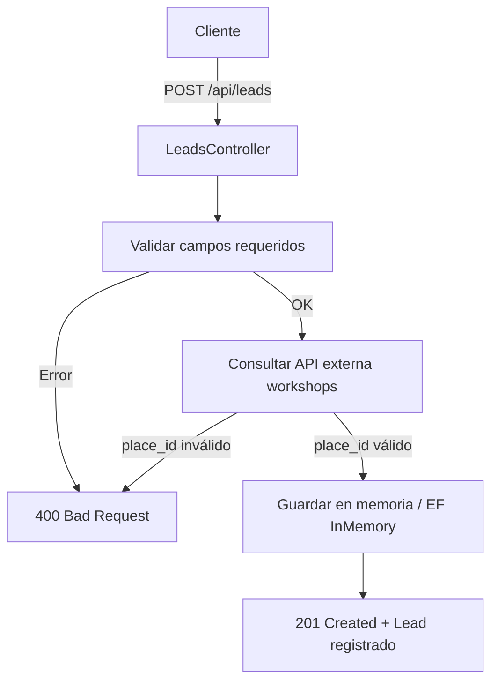

# Boxes Challenge - API de Gestión de Leads

## Diagrama




## Descripción

Esta es una API REST desarrollada en .NET que permite gestionar leads (turnos) para talleres automotrices. La aplicación forma parte del producto **Boxes** de Tecnom, enfocado en mejorar la postventa mediante la automatización y gestión eficiente de servicios.

## Arquitectura

El proyecto sigue una arquitectura limpia (Clean Architecture) con las siguientes capas:

```
src/
├── API/                 # Capa de presentación (Controllers, Program, Startup)
├── Application/         # Capa de aplicación (Services, DTOs, Validators)
├── Domain/              # Capa de dominio (Entities)
└── Infrastructure/      # Capa de infraestructura (DbContext, Repositories)
```

## Funcionalidades

### Endpoints Disponibles

#### 1. **GET /api/leads**
- **Descripción**: Obtiene todos los leads registrados
- **Respuesta**: Lista de leads con información completa
- **Códigos de respuesta**:
  - `200 OK`: Lista obtenida correctamente

#### 2. **GET /api/leads/{id}**
- **Descripción**: Obtiene un lead específico por su ID
- **Parámetros**: `id` (long) - ID del lead
- **Códigos de respuesta**:
  - `200 OK`: Lead encontrado
  - `404 Not Found`: Lead no encontrado

#### 3. **POST /api/leads**
- **Descripción**: Crea un nuevo lead (turno)
- **Validaciones**:
  - Campos requeridos
  - `place_id` debe existir en talleres activos
  - Formato de fecha ISO 8601
  - Tipos de servicio válidos
- **Códigos de respuesta**:
  - `201 Created`: Lead creado exitosamente
  - `400 Bad Request`: Datos inválidos / Taller inexistente o inactivo

### **Acceder a la documentación**
   - Swagger UI: `https://localhost:7010/swagger`
   - API Base: `https://localhost:7010/api`


### Lead Request ejemplo:
```json
{
  "place_id": 2,
  "appointment_at": "2025-10-01T10:00:00Z",
  "service_type": "cambio_aceite",
  "contact": {
    "name": "Juan Pérez",
    "email": "juan@gmail.com",
    "phone": "5493516586321"
  },
  "vehicle": {
    "make": "Toyota",
    "model": "Corolla",
    "year": 2020,
    "license_plate": "ABC123"
  }
}
```

### Tipos de Servicio Válidos
- `cambio_aceite`
- `rotacion_neumaticos`
- `otro`

## Tecnologías Utilizadas

- **.NET 8**: Framework principal
- **ASP.NET Core**: Para la API REST
- **Entity Framework Core**: ORM con proveedor InMemory
- **AutoMapper**: Mapeo de objetos
- **FluentValidation**: Validaciones
- **Swagger/OpenAPI**: Documentación de la API
- **HttpClient**: Consumo de API externa
- **IMemoryCache**: Evita consultas innecesarias a la API externa


### Para probar Timeout / BrokenCircuit con Polly, ejecutar otra api con un endpoint como este:

#### Para Timeout, solo con dejar el debugger por más de 10 segundos se activa, y luego si se vuelve a ejecutar el endpoint, se activa el BrokenCircuit.
```
[HttpGet("/api/v1/places/workshops")]
public IActionResult Post()
{
    bool isAvailable = false; 

    if (!isAvailable)
    {
        // Devuelve 503 Service Unavailable con un payload opcional
        return StatusCode(
            StatusCodes.Status503ServiceUnavailable,
            new { error = "Servidor no disponible. Por favor, inténtalo más tarde." }
        );
    }

    // Si todo está OK:
    return Ok(new { message = "Aquí van los talleres disponibles…" });
}

```

### Modificar `appsettings.json` para simular:
```
"AllowedHosts": "*",
  "WorkshopApi": {
    "Url": "https://localhost:7074/api/v1/",
    "Username": "myUsername",
    "Password": "myPassword"
  }
```