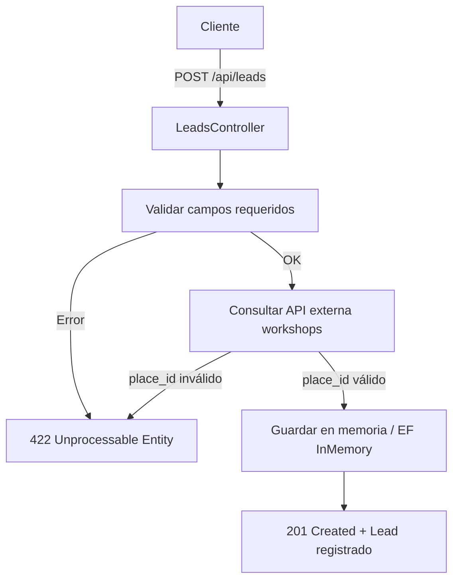

# BoxesChallenge

## Diagrama




Modelo request

```
{
  "place_id": 2222,
  "appointment_at": "2023-10-01T10:00:00Z",
  "service_type": "cambio_aceite",
  "contact": {
    "name": "Juan Pérez",
    "email": "juan@mail.com",
    "phone": "12345678"
  },
  "vehicle": {
    "make": "Toyota",
    "model": "Corolla",
    "year": 2020,
    "license_plate": "ABC123"
  }
}

```