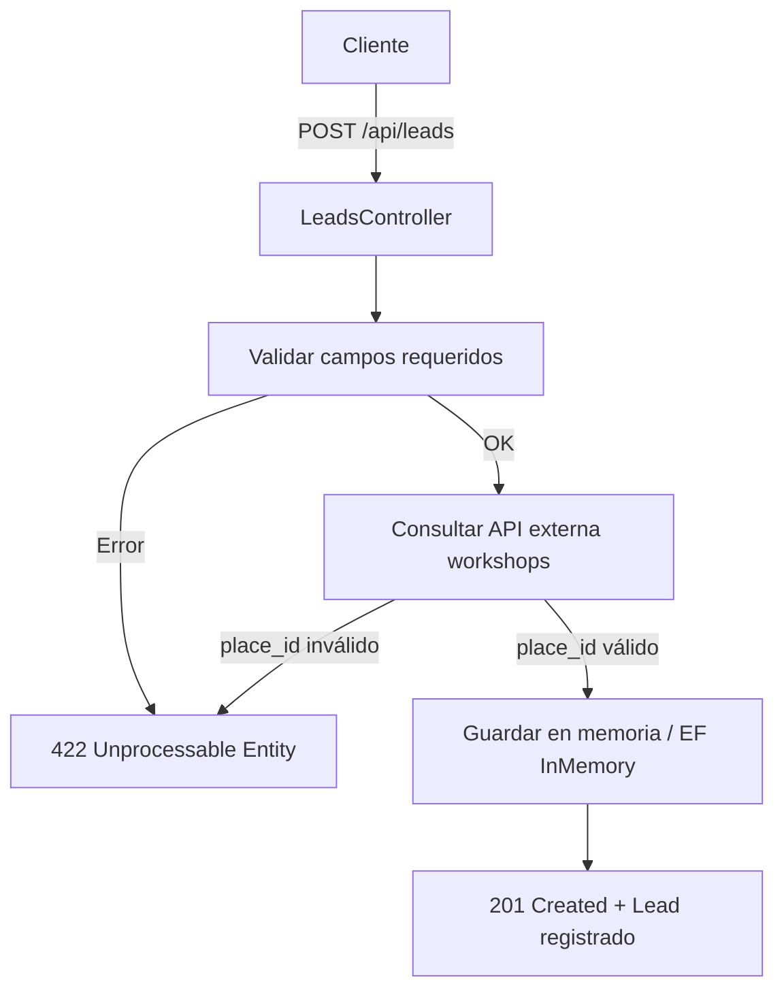

# Boxes Challenge - API de Gestión de Leads

## Diagrama




## 📋 Descripción

Esta es una API REST desarrollada en .NET que permite gestionar leads (turnos) para talleres automotrices. La aplicación forma parte del producto **Boxes** de Tecnom, enfocado en mejorar la postventa mediante la automatización y gestión eficiente de servicios.

## 🏗️ Arquitectura

El proyecto sigue una arquitectura limpia (Clean Architecture) con las siguientes capas:

```
src/
├── API/                 # Capa de presentación (Controllers, Program, Startup)
├── Application/         # Capa de aplicación (Services, DTOs, Validators)
├── Domain/             # Capa de dominio (Entities)
└── Infrastructure/     # Capa de infraestructura (DbContext, Repositories)
```

## 🚀 Funcionalidades

### Endpoints Disponibles

#### 1. **GET /api/leads**
- **Descripción**: Obtiene todos los leads registrados
- **Respuesta**: Lista de leads con información completa
- **Códigos de respuesta**:
  - `200 OK`: Lista obtenida correctamente

#### 2. **GET /api/leads/{id}**
- **Descripción**: Obtiene un lead específico por su ID
- **Parámetros**: `id` (long) - ID del lead
- **Códigos de respuesta**:
  - `200 OK`: Lead encontrado
  - `404 Not Found`: Lead no encontrado

#### 3. **POST /api/leads**
- **Descripción**: Crea un nuevo lead (turno)
- **Validaciones**:
  - Campos requeridos
  - `place_id` debe existir en talleres activos
  - Formato de fecha ISO 8601
  - Tipos de servicio válidos
- **Códigos de respuesta**:
  - `201 Created`: Lead creado exitosamente
  - `400 Bad Request`: Datos inválidos
  - `422 Unprocessable Entity`: Taller no válido

## 📊 Modelo de Datos

### Lead Request
```json
{
  "place_id": 2222,
  "appointment_at": "2023-10-01T10:00:00Z",
  "service_type": "cambio_aceite",
  "contact": {
    "name": "Juan Pérez",
    "email": "juan@mail.com",
    "phone": "12345678"
  },
  "vehicle": {
    "make": "Toyota",
    "model": "Corolla",
    "year": 2020,
    "license_plate": "ABC123"
  }
}
```

### Tipos de Servicio Válidos
- `cambio_aceite`
- `rotacion_neumaticos`
- `otro`

## 🔧 Tecnologías Utilizadas

- **.NET 8**: Framework principal
- **ASP.NET Core**: Para la API REST
- **Entity Framework Core**: ORM con proveedor InMemory
- **AutoMapper**: Mapeo de objetos
- **FluentValidation**: Validaciones
- **Swagger/OpenAPI**: Documentación de la API
- **HttpClient**: Consumo de API externa

## 🏭 Integración con API Externa

La aplicación consume la API de talleres de Tecnom:

- **URL**: `https://dev.tecnomcrm.com/api/v1/places/workshops`
- **Autenticación**: Basic Auth
  - Usuario: `max@tecnom.com.ar`
  - Contraseña: `b0x3sApp`
- **Cache**: Implementado para optimizar consultas

## 🚀 Cómo Ejecutar

### Prerrequisitos
- .NET 8 SDK
- Visual Studio 2022 o VS Code

### Pasos de Instalación

1. **Clonar el repositorio**
   ```bash
   git clone [URL_DEL_REPOSITORIO]
   cd BoxesChallenge
   ```

2. **Restaurar dependencias**
   ```bash
   dotnet restore
   ```

3. **Ejecutar la aplicación**
   ```bash
   cd src/API
   dotnet run
   ```

4. **Acceder a la documentación**
   - Swagger UI: `https://localhost:7001/swagger`
   - API Base: `https://localhost:7001/api`

## 📝 Ejemplos de Uso

### Crear un Lead
```bash
curl -X POST "https://localhost:7001/api/leads" \
  -H "Content-Type: application/json" \
  -d '{
    "place_id": 2222,
    "appointment_at": "2023-10-01T10:00:00Z",
    "service_type": "cambio_aceite",
    "contact": {
      "name": "Juan Pérez",
      "email": "juan@mail.com",
      "phone": "12345678"
    },
    "vehicle": {
      "make": "Toyota",
      "model": "Corolla",
      "year": 2020,
      "license_plate": "ABC123"
    }
  }'
```

### Obtener Todos los Leads
```bash
curl -X GET "https://localhost:7001/api/leads"
```

### Obtener un Lead por ID
```bash
curl -X GET "https://localhost:7001/api/leads/1"
```

## 🧪 Testing

La aplicación incluye validaciones automáticas para:
- Campos requeridos
- Formato de email
- Formato de fecha ISO 8601
- Existencia del taller en la API externa
- Tipos de servicio válidos

## 📚 Estructura del Proyecto

```
BoxesChallenge/
├── src/
│   ├── API/                    # Controladores y configuración
│   │   ├── Controllers/        # LeadsController
│   │   ├── Program.cs          # Punto de entrada
│   │   └── Startup.cs          # Configuración de servicios
│   ├── Application/            # Lógica de aplicación
│   │   ├── DTOs/              # Objetos de transferencia
│   │   ├── Services/          # Servicios de negocio
│   │   ├── Validators/        # Validaciones
│   │   └── Interfaces/        # Contratos de servicios
│   ├── Domain/                # Entidades de dominio
│   │   └── Entities/          # Lead, Contact, Vehicle
│   └── Infrastructure/        # Acceso a datos
│       ├── Repositories/      # Implementación de repositorios
│       └── Services/          # Servicios externos
└── tests/                     # Pruebas unitarias
```

## 🔍 Características Destacadas

- **Arquitectura Limpia**: Separación clara de responsabilidades
- **Validaciones Robustas**: FluentValidation para validaciones complejas
- **Cache Inteligente**: Evita consultas innecesarias a la API externa
- **Documentación Automática**: Swagger con ejemplos y códigos de respuesta
- **Manejo de Errores**: Respuestas HTTP apropiadas con mensajes claros
- **Base de Datos InMemory**: Para desarrollo y testing

## 🤝 Contribución

Este proyecto fue desarrollado como parte del challenge técnico de Tecnom. Para contribuir:

1. Fork el repositorio
2. Crea una rama para tu feature
3. Commit tus cambios
4. Push a la rama
5. Abre un Pull Request

## 📄 Licencia

Este proyecto es parte del challenge técnico de Tecnom y está destinado únicamente para evaluación.